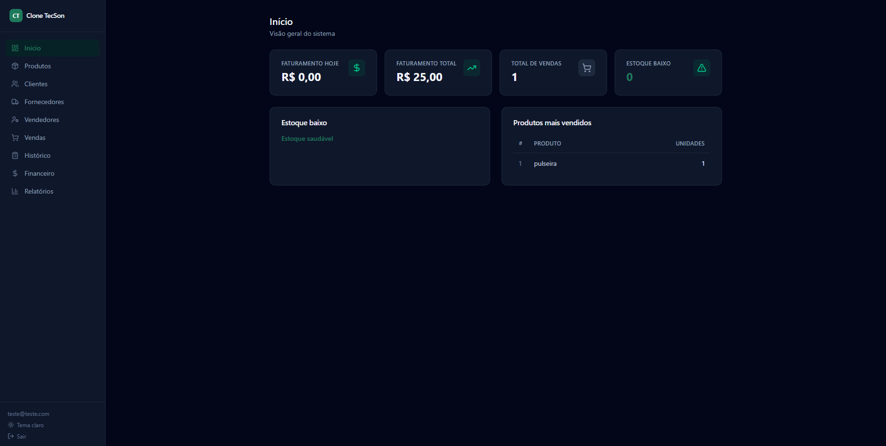

# Clone TecSon

Sistema de gestão comercial (mini-ERP) construído com React + Vite, Tailwind CSS e Supabase. Inclui login, dashboard, e cadastro/gestão de produtos, clientes, fornecedores, vendedores, vendas, histórico, financeiro e relatórios.

> Projeto pessoal/educacional inspirado no TecSon, sem qualquer afiliação, endosso ou vínculo oficial com o produto ou empresa originais.



## Funcionalidades

- Autenticação de usuários
- Cadastro e gestão de produtos, clientes, fornecedores e vendedores
- Registro de vendas com histórico completo
- Cálculo automático de comissão por vendedor
- Módulo financeiro
- Relatórios com gráficos e filtro por período
- Dark mode
- Sistema próprio de notificações

## Arquitetura

O sistema é multi-tenant: várias empresas usam a mesma aplicação e o mesmo banco de dados, cada uma enxergando apenas os próprios dados.

O isolamento entre empresas é garantido por Row Level Security (RLS) diretamente no PostgreSQL, com 22 policies cobrindo as tabelas do sistema, em vez de filtro manual nas queries da aplicação. A decisão foi deliberada: se o isolamento dependesse de todo desenvolvedor lembrar de incluir `WHERE empresa_id = X` em cada query, um único endpoint esquecido seria suficiente para vazar dado de uma empresa para outra. Com RLS, essa garantia sai do código da aplicação e vira uma regra estrutural do banco, aplicada automaticamente em qualquer query, de qualquer origem.

## Stack

- [React 19](https://react.dev/) + [Vite](https://vitejs.dev/)
- [Tailwind CSS 4](https://tailwindcss.com/)
- [Supabase](https://supabase.com/) (autenticação, banco de dados e RLS)
- [Radix UI](https://www.radix-ui.com/) + [lucide-react](https://lucide.dev/) para componentes/ícones
- [Recharts](https://recharts.org/) para gráficos

## Pré-requisitos

- Node.js 18+
- Uma conta e projeto no [Supabase](https://supabase.com/)

## Configuração

1. Clone o repositório e instale as dependências:

```bash
   git clone https://github.com/marcoturs/clone-tecson.git
   cd clone-tecson
   npm install
```

2. Copie o arquivo de variáveis de ambiente de exemplo e preencha com as credenciais do seu projeto Supabase (disponíveis em **Project Settings > API**):

```bash
   cp .env.example .env
```

```
VITE_SUPABASE_URL=https://seu-projeto.supabase.co
VITE_SUPABASE_KEY=sua-chave-publishable
```


3. Rode o projeto em modo desenvolvimento:

```bash
   npm run dev
```

## Scripts

- `npm run dev` — inicia o servidor de desenvolvimento
- `npm run build` — gera a build de produção
- `npm run preview` — pré-visualiza a build de produção
- `npm run lint` — roda o ESLint

## Licença

Distribuído sob a licença [MIT](LICENSE).
